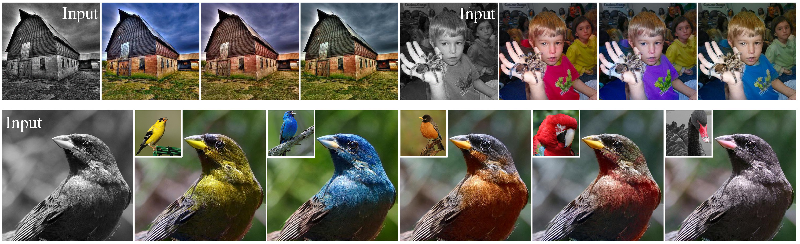
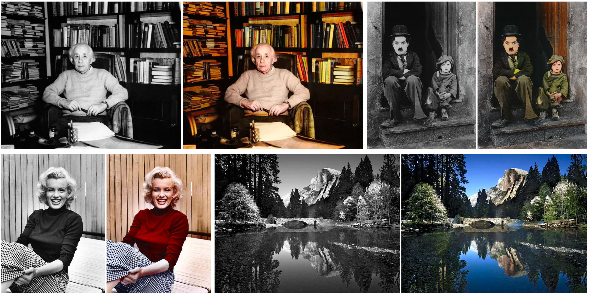

## BigColor: Colorization using a Generative Color Prior for Natural Images<br><sub>Official PyTorch Implementation of the ECCV 2022 Paper</sub>



**BigColor: Colorization using a Generative Color Prior for Natural Images**<br>
Geonung Kim, Kyoungkook Kang, Seongtae Kim, Hwayoon Lee, Sehoon Kim, Jonghyun Kim, Seung-Hwan Baek, Sunghyun Cho<br>

[\[Paper\]](https://github.com/KIMGEONUNG/BigColor)
[\[Supple\]](https://github.com/KIMGEONUNG/BigColor)
[\[Project Page\]](https://kimgeonung.github.io/BigColor)

Abstract: *For realistic and vivid colorization, generative priors have recently been exploited. However, such generative priors often fail for in-the-wild complex images due to their limited representation space. In this paper, we propose BigColor, a novel colorization approach that provides vivid colorization for diverse in-the-wild images with complex structures. While previous generative priors are trained to synthesize both image structures and colors, we learn a generative color prior to focus on color synthesis given the spatial structure of an image. In this way, we reduce the burden of synthesizing image structures from the generative prior and expand its representation space to cover diverse images. To this end, we propose a BigGAN-inspired encoder-generator network that uses a spatial feature map instead of a spatially-flattened BigGAN latent code, resulting in an enlarged representation space. Our method enables robust colorization for diverse inputs in a single forward pass, supports arbitrary input resolutions, and provides multi-modal colorization results. We demonstrate that BigColor significantly outperforms existing methods especially on in-the-wild images with complex structures.*


### Environment

We use python3.8 in _Ubuntu 20.04.2 LTS_ operation system as development environment.
We provide a anaconda environment file for running the code. 
Run the instruction below on your bash prompt.

```bash
conda env create -f environment.yml
```

### Pretrained Models

The training for BigColor needs some pretrained models and configuration files.
To automatically download the files, we provide a script requiring _gdown_.
Therefore you should install _gdown_ using the script below.

```bash
pip install gdown
pip install --upgrade gdown
```

After installing gdown, run the command below on your bash propmt for the prerequisite.  

```bash
./download-pretrained.sh
```

If you want to get a pretrained BigColor checkpoint, also run the command below 

```bash
./download-bigcolor.sh
```

It is possible to fail to download the file using the bash scripts.
Then use this [link](https://drive.google.com/drive/folders/1nLzgE5WJnxp5WF1dkpa1ts6bZ6tVwtep?usp=sharing) for download using google drive.

Finally, a structure of the files is as follows.

```bash
BigColor
├── ckpts
│   └── bigcolor
│       ├── args.pkl
│       ├── EG_011.ckpt
│       └── EG_EMA_011.ckpt
├── pretrained
│   ├── config.pickle
│   ├── D_256.pth
│   ├── G_ema_256.pth
│   └── vgg16.pickle

...
```

### Datasets

For training with ImageNet1K, you have to download ImageNet1K training and validation set.
Unfortunately, the validation set is generally not organized for each class lables, that is, _all validation images stored in a directory_. 
So, we provide a arranged validation files based on class lable. 
Use this [link](https://drive.google.com/drive/folders/1nLzgE5WJnxp5WF1dkpa1ts6bZ6tVwtep?usp=sharing)
and download the file: _imageNet_validation_grouping.zip_.
As a results, the final directory structure of the data is as follows.

```bash
BigColor/imgnet/train/
├── n01440764
│   ├── n01440764_10026.JPEG
│   ├── n01440764_10027.JPEG
│   ├── n01440764_10029.JPEG

...

BigColor/imgnet/val/
├── n01440764
│   ├── ILSVRC2012_val_00000293.JPEG
│   ├── ILSVRC2012_val_00002138.JPEG
│   ├── ILSVRC2012_val_00003014.JPEG

...
```

### Colorization


#### ImageNet1K Validation 

If you want to get the same inference results used in our paper,
Use this [link](https://drive.google.com/drive/folders/1nLzgE5WJnxp5WF1dkpa1ts6bZ6tVwtep?usp=sharing)
and download the file: _bigcolor_inference.zip_.
Otherwise, run the code below.
Note that the validation set should be structured based on the classes via directory.

```bash
./scripts/infer.bigcolor.e011.sh
```

#### Real Gray Colorization

We provide a script for colorizing a real grayscale iamge with arbitrary resolution.
The example code is as follow.

```bash
./scripts/colorize.real.sh
```

#### Multi-modal Solutions

We provide a script for testing the multiple solutions from a input.
The example codes are as follow.

```bash
# using class vector c
./scripts/colorize.multi_c.sh
```

```bash
# using random vector z
./scripts/colorize.multi_z.sh
```


### Acknowledgement
The code of pretrained-BigGAN generator and discriminator and checkpoints are borrowed from
a research: [DGP](https://github.com/XingangPan/deep-generative-prior).


### Citation

```
@inproceedings{Kim2022Bigcolor,
  title     = {BigColor: Colorization using a Generative Color Prior for Natural Images},
  author    = {Geonung Kim,Kyoungkook Kang,Seongtae Kim,Hwayoon Lee,Sehoon Kim,Jonghyun Kim,Seung-Hwan Baek,Sunghyun Cho},
  booktitle = {European Conference on Computer Vision (ECCV)},
  year      = {2022}
}

```
